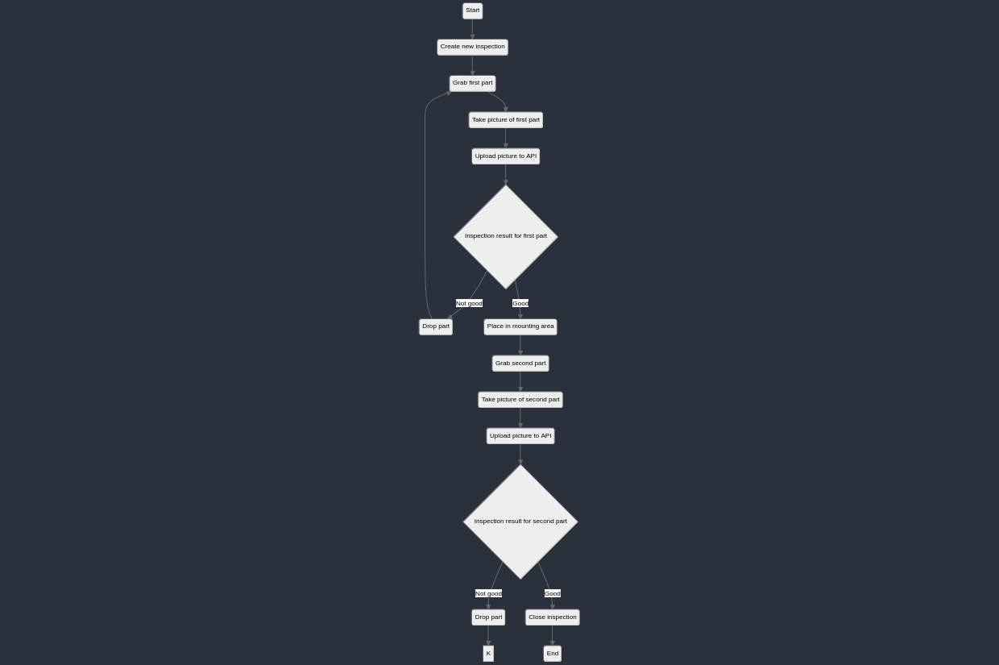

# Full inspection cycle

**Please note that this example is provided as-is with no guarantees of support.**

This example shows how to use the AVIS API to perform a full inspection cycle, from opening an inspection to closing it.

The inspection process is roughly modelled after the following state diagram:



## Requirements
* python 3.10 or higher
* [poetry](https://python-poetry.org/)
* [Luxonis OAK-D camera](https://www.luxonis.com/)


## Installation
```bash
poetry install
```

## Run
```bash
poetry run python full_cycle/main.py
```
